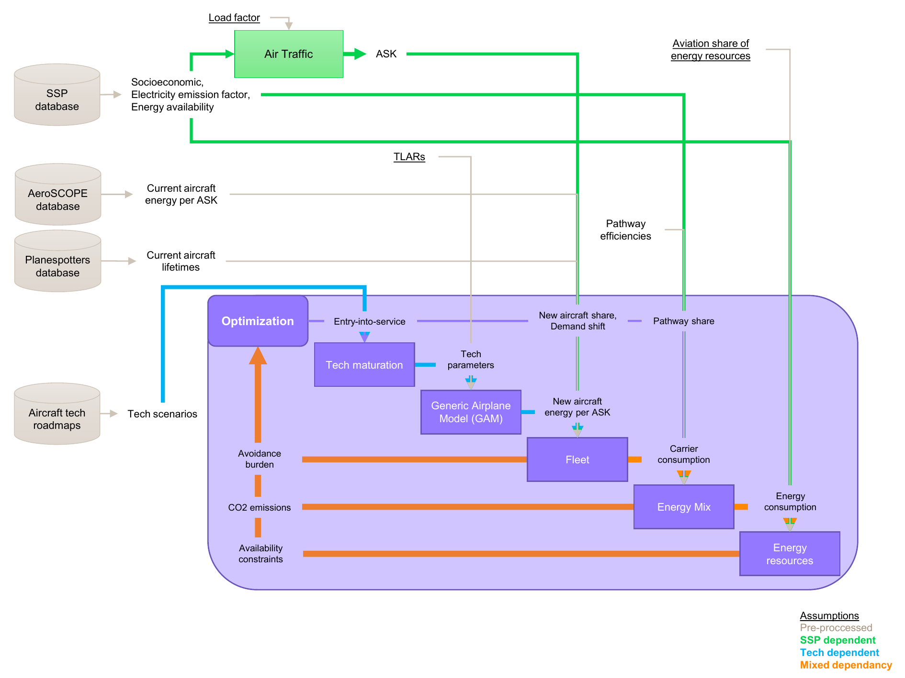

<!--
 Copyright 2025 ISAE-SUPAERO, https://www.isae-supaero.fr/en/
 Copyright 2021 IRT Saint Exupéry, https://www.irt-saintexupery.com

 This work is licensed under the Creative Commons Attribution-ShareAlike 4.0
 International License. To view a copy of this license, visit
 http://creativecommons.org/licenses/by-sa/4.0/ or send a letter to Creative
 Commons, PO Box 1866, Mountain View, CA 94042, USA.
-->

# Core concepts

NOADS sits at the intersection of **aviation engineering**, **energy systems**, and
**climate policy**. Before diving into the code, it helps to understand the five
building blocks that make up the framework.

## The big picture



The figure above shows the data-flow between model disciplines and the optimization
loop. Before the optimization starts, the chosen global scenario (from the **SSP
database**) determines the evolution of socioeconomic drivers (population and economy)
and the energy system (global production of biomass and electricity, and emission factor
of grid electricity). Current aircraft data is pre-processed from the **AeroSCOPE** and
**Planespotters** databases, while technology roadmaps provide component-level
performance forecasts.

Then, iteratively, the **optimizer** chooses a set of policy variables — entry-into-
service dates, new aircraft market shares, demand shift, and pathway shares — and the
simulation models are evaluated: **Air Traffic** produces ASK from socioeconomic data,
**Tech maturation** and **GAM** size new aircraft from technology parameters and TLARs,
the **Fleet** model computes carrier consumption from market shares and aircraft
efficiencies, the **Energy Mix** resolves production pathways into CO₂ emissions, and
**Energy resources** checks availability constraints. The optimizer receives CO₂
emissions, availability constraints, and avoidance burden as feedback to guide the
next iteration.

---

## 1. Models

A {class}`~noads.core.model.Model` is the atomic unit: a function that computes outputs from
inputs, wrapped as a [GEMSEO-JAX](https://gitlab.com/gemseo/dev/gemseo-jax) discipline.

NOADS provides three base classes:

| Class | When to use |
|-------|-------------|
| **AutoModel** | Most common. Auto-discovers inputs and outputs from the function signature. |
| **JAXModel** | When you need explicit control over input/output names. |
| **Model** | Wraps an existing `JAXDiscipline` directly. |

Because every model is a JAX function, **gradients are computed automatically** via
automatic differentiation — no finite differences needed.

:::{dropdown} A model in practice
```python
from noads.core.model import AutoModel

def my_emission_model(fuel_burn, emission_index):
    co2 = fuel_burn * emission_index
    return co2

model = AutoModel(my_emission_model, name="emissions")
```
:::
---

## 2. Scenarios

A {class}`~noads.core.scenarios.temporalscenario.TemporalScenario` assembles models into a
**time-dependent optimization problem**. It handles:

- **Time vectorization**: models are evaluated at each time step (2025–2075), but only
  those with time-dependent inputs are vectorized — constant models are computed once.
- **Control interpolation**: decision variables are defined at a few time knots and
  interpolated (linear or cubic spline) to the full time vector.
- **ODE integration**: first-order delays (technology diffusion, fleet turnover) are
  solved with [diffrax](https://github.com/patrick-kidger/diffrax) (Dormand–Prince 5).
- **Constraint assembly**: cumulative carbon budgets, resource limits, and feasibility
  bounds are collected automatically.

```{mermaid}
flowchart TB
    OPT[Optimizer<br/>GEMSEO + SLSQP] -->|control knots +<br/>scalar variables| Interp

    subgraph TS[TemporalScenario]
        direction TB
        Interp[Control interpolation<br/>to yearly time vector]
        ODE[ODE integration<br/>first-order delays]
        Models[Model chain<br/>traffic + fleet + energy]
    end

    Interp --> ODE --> Models
    Models --> Obj[Objectives & constraints<br/>cumulative CO₂, cost,<br/>availability, avoidance]
    Obj -->|objective +<br/>constraints| OPT
```

The **optimizer** decides the control knots (time-dependent shares, demand shift) and
scalar optimization variables (entry-into-service dates) to feed into the
TemporalScenario. Inside the scenario, controls are interpolated to the yearly time
vector, then first-order delay ODEs are integrated (fleet turnover, technology
diffusion), and the resulting delayed controls are passed to the model chain (traffic,
fleet, energy). The scenario returns objectives and constraints back to the optimizer
for the next iteration.

For **robust optimization** across multiple climate futures, a
{class}`~noads.core.scenarios.multiscenario.MultiScenario` vectorizes a `TemporalScenario`
across several SSP pathways and can aggregate outputs (e.g., mean cumulative emissions
across scenarios).

---

## 3. Fleet

The fleet module models **aircraft operating in five market segments** (general,
commuter, regional, short–medium haul, long range):

- {class}`~noads.core.models.fleet.aircraft_operation.AircraftOperation`: an existing aircraft
  type with known energy consumption, propulsion system, and lifetime. The current fleet
  is initialized from the AeroSCOPE and Planespotters databases.
- {class}`~noads.core.models.fleet.aircraft_design.AircraftDesign`: a *new* aircraft whose
  performance is estimated by the **Generic Airplane Model (GAM)**, a physics-based
  sizing tool. Each design is sized at a given **entry-into-service year** (EIS, an
  optimization variable), which determines which technology generation is available.
  Technology parameters (battery density, motor power, structural efficiency) evolve over
  time via {class}`~noads.core.models.fleet.aircraft_tech_parameter.AircraftTechParameter`.
- {class}`~noads.core.models.fleet.fleet.Fleet`: aggregates multiple aircraft competing in the
  same market. It receives from the optimizer the **EIS** and **maximum market share**
  ($S^\max$) of each aircraft type and computes **market shares over time** via ramped
  pulse inputs to a first-order delay ODE, accounting for demand avoidance and fleet
  turnover.

```{mermaid}
flowchart TB
    OPT[Optimizer] -->|EIS per aircraft<br/>per market| AD
    Tech[Technology<br/>parameters<br/>2020 → 2040 → 2060] --> AD

    subgraph Designs["Aircraft designs (one per architecture × market)"]
        AD[GAM sizing<br/>at EIS]
        AD --> JetA_GT[JetA-GasTurbine<br/>v1 & v2]
        AD --> lH2_GT[lH2-GasTurbine]
        AD --> lH2_FC[lH2-FuelCell]
        AD --> BatE[Battery-Electric<br/>General + Commuter only]
    end

    JetA_GT & lH2_GT & lH2_FC & BatE -->|energy per ASK| FA
    OPT -->|S_max per aircraft<br/>per market| FA

    AO[Current aircraft<br/>AeroSCOPE] -->|energy per ASK<br/>+ lifetime| FA
    AT[Air Traffic] -->|ASK per market| FA

    subgraph FA[FleetAssembly]
        F0[Fleet — General]
        F1[Fleet — Commuter]
        F2[Fleet — Regional]
        F3[Fleet — Short–medium]
        F4[Fleet — Long range]
    end

    FA --> Cons[Carrier consumption<br/>per energy type]
```

---

## 4. Energy system

The energy module traces **production pathways from primary resources to final energy
carriers**:

- {class}`~noads.core.models.energy.energy.EnergyCarrier`: a fuel or energy medium (kerosene,
  liquid hydrogen, battery electricity) with physical properties (specific energy,
  density).
- {class}`~noads.core.models.energy.production_pathway.ProductionPathway`: a route to produce
  energy (e.g., Fischer–Tropsch from biomass, electrolysis from renewable electricity),
  with associated CO₂, cost, and resource impacts.
- {class}`~noads.core.models.energy.energy_mix.EnergyMix`: assembles all pathways and carriers,
  resolving inter-dependencies (e.g., electricity is both a final carrier *and* an input
  to hydrogen production) and computing total system-wide impacts.

```{mermaid}
flowchart LR
    Oil[Oil] --> Refinery --> Kerosene
    Bio[Biomass] --> HEFA & FT & ATJ
    HEFA --> Biofuel
    FT --> Biofuel
    ATJ --> Biofuel
    Elec[Electricity] --> Electrolysis --> GH2[Gas H₂]
    GH2 --> PtL[Power-to-Liquid]
    Elec --> PtL
    PtL --> EFuel[E-fuel]

    Kerosene -->|Fossil| JetA[JET-A]
    Biofuel -->|Biofuel| JetA
    EFuel -->|Electrofuel| JetA

    GH2 --> Liq[Liquefaction]
    Elec --> Liq
    Liq --> LH2[Liquid H₂]

    Elec --> Charging --> Bat[Battery]

    subgraph Final[Final energy carriers — embarked in aircraft]
        JetA
        LH2
        Bat
    end
```

---

## 5. Background scenarios

NOADS does not run in a vacuum — it is driven by **exogenous socioeconomic and climate
data** from the IPCC's 6th Assessment Report (AR6) {cite:p}`ar6_database`:

- **SSP pathways** (Shared Socioeconomic Pathways): SSP1 through SSP5 provide GDP per
  capita and population trajectories that drive air traffic demand via a generalized
  logistic model.
- **Carbon budgets**: each SSP + temperature target combination (e.g., SSP2-2.6°C) comes
  with a remaining global CO₂ budget. Aviation's share is configurable (default ~3%).
- **Resource availability**: biomass and electricity supply projections bound the
  feasibility of alternative fuels.

These data are loaded from Excel files in the `application/ar6_scenarios_data/` directory
and injected into the scenario as exogenous inputs.

---

## Putting it all together

A typical NOADS workflow looks like this:

1. **Choose a climate scenario** (e.g., SSP2-2.6°C, mid-tech).
2. **Set up the scenario**: `single_scenario_setup()` builds the fleet, energy system,
   temporal scenario, design space, and constraints.
3. **Run the optimization**: GEMSEO drives the SLSQP optimizer with JAX-computed
   gradients to find the policy trajectory that minimizes cumulative CO₂ (or cost)
   within the carbon budget.
4. **Visualize results**: plot emissions, fleet composition, and energy mix over time.

```python
from noads.application.examples import single_policy_scenario_optimization

results = single_policy_scenario_optimization(
    global_scenario_name="SSP2-26",
    technology_index=1,       # mid-tech assumptions
    carbon_budget_percent=3,  # aviation's share of the global CO₂ budget
    plot_optimum=True,
)
```

For a hands-on walkthrough, continue to the [quickstart guide](quickstart.md).

---

## Software architecture

The diagrams below show the class hierarchy for developers and contributors who want to
understand or extend the code.

:::{dropdown} Core model hierarchy
```{mermaid}
classDiagram
    class AutoModel {
      discipline : AutoJAXDiscipline
    }
    class JAXModel {
    }
    class Model {
      discipline : JAXDiscipline
    }
    AutoModel --|> Model
    JAXModel --|> Model
```
:::
:::{dropdown} Scenario hierarchy
```{mermaid}
classDiagram
    class MultiScenario {
      fixed_inputs : list[str]
      mean_outputs : list[str]
      scenario_inputs : list[str]
      scenario_names : list[str]
      temporal_scenario
    }
    class TemporalScenario {
      constant_inputs : list[str]
      constrained_control_groups
      control_delay_times
      cubic_interpolation : bool
      interpolated_inputs : list[str]
      models : list[Model]
      time_integrated_outputs : list[str]
      time_vector
      vectorized_chain : JAXChain
    }
    TemporalScenario --* MultiScenario : temporal_scenario
```
:::
:::{dropdown} Fleet & energy class diagram
```{mermaid}
classDiagram
    class GAM {
    }
    class Fleet {
      consumed_carriers : list[EnergyCarrier]
      models : list[Model]
      operating_aircraft : list[AircraftOperation | AircraftDesign]
    }
    class FleetAssembly {
      fleets : list[Fleet]
    }
    class AircraftDesign {
      mission : Mapping
      power_system : Mapping
      reference_aircraft
      technology_evolution : list[AircraftTechParameter]
    }
    class AircraftOperation {
      energy_per_ask : float
      lifetime : float
      propulsion
    }
    class AircraftTechParameter {
      name : str
      value_2020 : float
      value_2040 : float
      value_2060 : float
    }
    class EnergyMix {
      final_energies : list[ProducedEnergyCarrier]
      impacts : list[Impact]
      input_streams : list[Stream]
      produced_energies : set[ProducedEnergy]
    }
    class ProducedEnergy {
      pathways : list[ProductionPathway]
    }
    class ProductionPathway {
      impacts : list[Impact]
      input_streams : list[Stream]
    }
    class EnergyCarrier {
      specific_energy : float
    }
    class PropulsionSystem {
      energy_carrier_mix : Mapping
    }
    AircraftOperation --* AircraftDesign : reference_aircraft
    PropulsionSystem --* AircraftOperation : propulsion
    PropulsionSystem --o EnergyCarrier : energy_carrier_mix
    ProductionPathway --o Impact : impacts
    ProducedEnergy --o ProductionPathway : pathways
    Fleet --o AircraftOperation : operating_aircraft
    AircraftDesign --o AircraftTechParameter : technology_evolution
    AircraftDesign --o GAM
    EnergyMix --o ProducedEnergy : secondary_energies
    EnergyMix --o Impact : impacts
    AircraftDesign --|> AircraftOperation
    FleetAssembly --|> Fleet
```
:::
