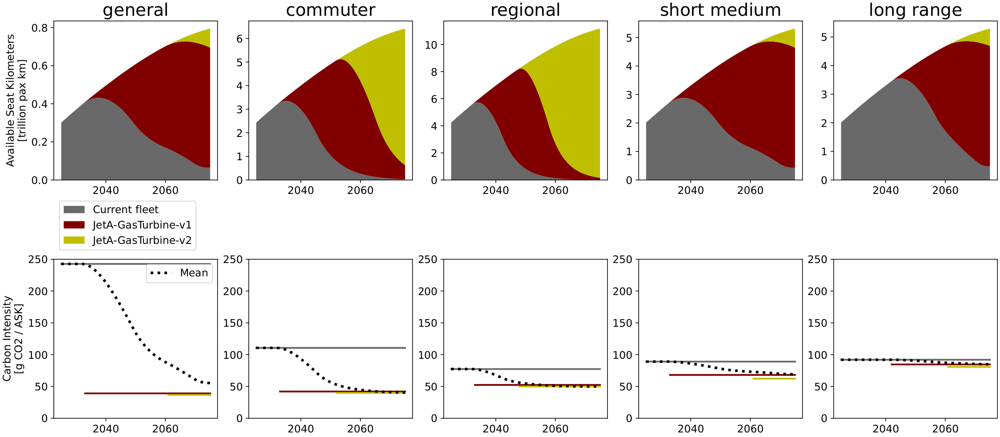
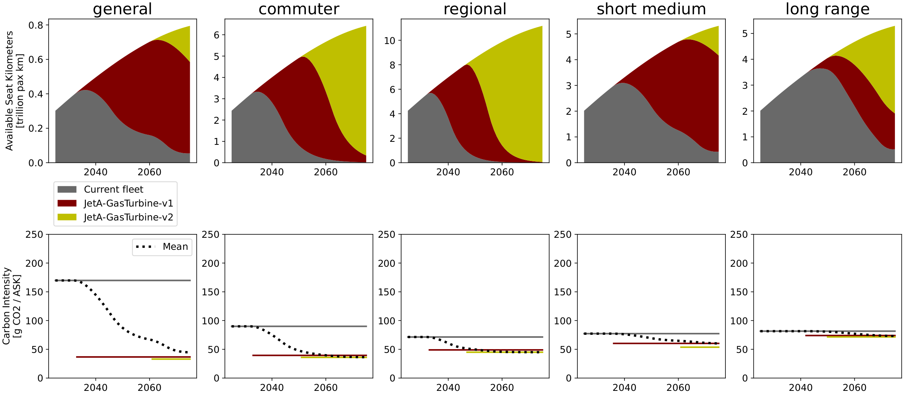
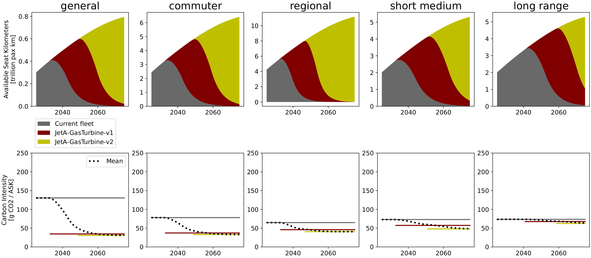

<!--
 Copyright 2025 ISAE-SUPAERO, https://www.isae-supaero.fr/en/
 Copyright 2021 IRT Saint Exupéry, https://www.irt-saintexupery.com

 This work is licensed under the Creative Commons Attribution-ShareAlike 4.0
 International License. To view a copy of this license, visit
 http://creativecommons.org/licenses/by-sa/4.0/ or send a letter to Creative
 Commons, PO Box 1866, Mountain View, CA 94042, USA.
-->

# Baseline scenarios

The emissions in baseline scenarios are mainly driven by the growth in RPK demand,
shown in {numref}`fig-trends-baseline` along with the annual and cumulative CO2
emissions. SSP5 displays the highest initial demand growth, while SSP1 and 2 show
close agreement until around 2050, where SSP2 demand continues to grow while SSP1
demand peaks and then declines.

All scenarios are subject to the deployment of new conventional aircraft by 2030,
which allows for reducing energy and carbon intensity. {numref}`fig-baseline-fleet`
breaks down fleet composition and carbon intensity among market segments. Efficiency
gains are most pronounced over shorter ranges. The general market for instance can
achieve over 3x lower consumption with dedicated aircraft relative to current median
commercial flights, however the segment has the longest aircraft lifetimes and
accounts for less than 3 % of global supply. It's in the commuter and regional
segments where renewal generates most of the system-wide impacts, due to their
moderate-to-high efficiency gains, fast fleet renewal, and higher shares of supply
(22 % and 39 %, respectively). The short-medium and long-range markets retain
substantial shares of current aircraft for longer (slower renewal), but also because
it takes time for expected weight reduction targets to perform better than current
standards (later EIS).

```{figure} ../figures/figs/fleet_SSP2-26-Fossil-midTech.png
:name: fig-baseline-fleet
:width: 100%

Aircraft fleet composition and carbon intensity of supply for each of the market
segments, for the no-policy baseline SSP2 scenario with Mid aircraft technology.
```

This leads to annual emissions that are growing until a peak is reached around 2040,
where efficiency gains due to aircraft replacement outpace demand growth. However,
after the introduction of the first generation of new aircraft, further energy
consumption gains with the second generation are only marginal. In SSPs 1 and 5
emissions practically stabilize after the peak due to due to slower pace of demand
growth, while continued demand growth in SSP2 result growing emissions after fleet is
replaced. All of the baseline scenarios display much higher emission levels compared
to the year 2019, around 50 % higher for SSP1, 80 % for SSP2, and 120 % for SSP5.

Cumulative emissions are also much higher than what the considered fair share for
aviation. All baseline scenarios exceed its share of contribution to the Paris
Agreement target of 2° C by a factor of 2-3, exceeding its share of carbon budget as
soon as 2040 in SSP5 and 2046 in SSPs 1 and 2.

## Full results

Fleet deployment for the Baseline SSP2 scenarios (supplementary information of the
published article):

::::{tab-set}

:::{tab-item} Low technology

:::

:::{tab-item} Mid technology

:::

:::{tab-item} Upper technology

:::

::::

## Reproduce these results

The baseline optimizations and the comparison figure are produced by the following
scripts (the `run_*` scripts re-run the optimizations; the comparison loads the
pre-computed optima shipped with the repository):

```{eval-rst}
.. minigallery:: examples/optimization/baseline/*.py
```
