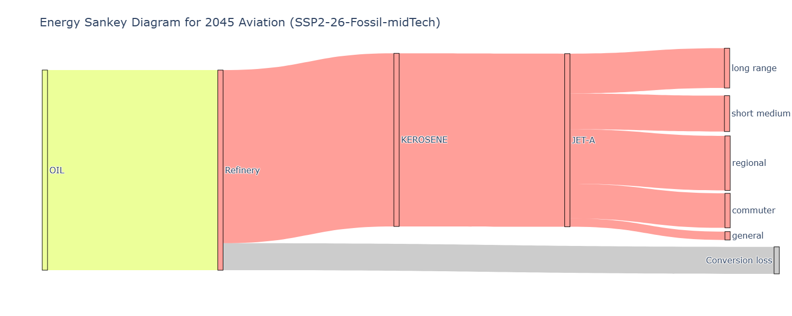
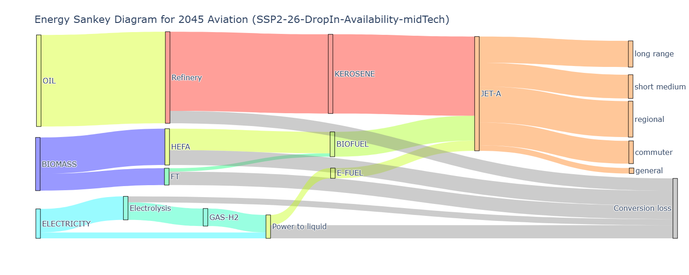
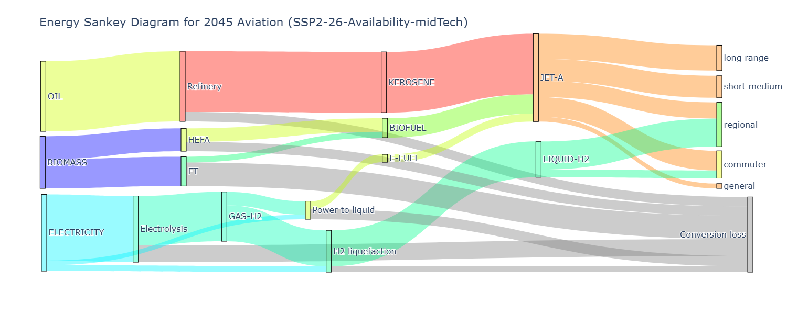
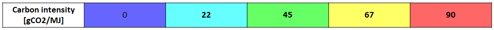

<!--
 Copyright 2025 ISAE-SUPAERO, https://www.isae-supaero.fr/en/
 Copyright 2021 IRT Saint Exupéry, https://www.irt-saintexupery.com

 This work is licensed under the Creative Commons Attribution-ShareAlike 4.0
 International License. To view a copy of this license, visit
 http://creativecommons.org/licenses/by-sa/4.0/ or send a letter to Creative
 Commons, PO Box 1866, Mountain View, CA 94042, USA.
-->

(sec-results)=

# Scenario Results

Several policy scenarios are simulated using the numerical optimization methods
presented, these are summarized in {numref}`tab-scenarios`.

:::{tip}
Every scenario in this section can be reproduced with the scripts of the
[optimization examples gallery](../../gallery/optimization/index.rst): the `run_*.py`
scripts re-run each optimization, and the `plot_compare_*.py` scripts regenerate the
comparison figures from the pre-computed optima shipped with the repository.
:::

```{list-table} Overview of simulated scenarios and their assumptions regarding: the background scenario, personal demand saturation, presence of traffic aversion policies, optimization objective, energy carriers included, the share of global energy production allocated to aviation, and the technology scenarios. In case multiple background scenarios, the objective is the mean among realizations. The demand saturation indicates storyline-specific assumptions on the stabilization level of per-capita demand. In presence of extra price-based traffic aversion, the objective is the minimization of relative ticket price increase. The energy carriers included are subject to variable Entry-Into-Service, and are limited to a fixed share of global production of biomass and electricity. Finally, the technology scenarios are determinant of the aircraft technology parameters, impacting the performance of new aircraft designs, driving the choice of which architectures to deploy.
:name: tab-scenarios
:header-rows: 1

* - Scenario name
  - Background scenario
  - Demand saturation
  - Traffic aversion
  - Policy objective (min)
  - Energy carriers
  - % of production
  - Tech scenarios
* - Baseline SSP1
  - SSP1-1.9
  - Trend -10%
  -
  - Cumulative CO2
  - Jet-A (fossil)
  -
  - Lower, Mid, Upper
* - Baseline SSP2
  - SSP2-2.6
  - Trend
  -
  - Cumulative CO2
  - Jet-A (fossil)
  -
  - Lower, Mid, Upper
* - Baseline SSP5
  - SSP5-4.5
  - Trend +50%
  -
  - Cumulative CO2
  - Jet-A (fossil)
  -
  - Lower, Mid, Upper
* - Drop-in trend
  - SSP2-2.6
  - Trend
  -
  - Cumulative CO2
  - Jet-A (fossil+SAF)
  - 5.0
  - Lower, Mid, Upper
* - Drop-in availability
  - SSP2-2.6
  - Trend
  -
  - Cumulative CO2
  - Jet-A (fossil+SAF)
  - 8.6
  - Lower, Mid, Upper
* - Drop-in low-demand
  - SSP2-2.6
  - Trend
  - ✓
  - **Rel. price increase**
  - Jet-A (fossil+SAF)
  - 5.0
  - Lower, Mid, Upper
* - Breakthrough trend
  - SSP2-2.6
  - Trend
  -
  - Cumulative CO2
  - Jet-A (fossil+SAF), LH2, Battery
  - 5.0
  - Lower, Mid, Upper
* - Breakthrough availability
  - SSP2-2.6
  - Trend
  -
  - Cumulative CO2
  - Jet-A (fossil+SAF), LH2, Battery
  - 8.6
  - Lower, Mid, Upper
* - Breakthrough low-demand
  - SSP2-2.6
  - Trend
  - ✓
  - **Rel. price increase**
  - Jet-A (fossil+SAF), LH2, Battery
  - 5.0
  - Lower, Mid, Upper
* - Scenario-robust trend
  - SSP2-1.9, 2.6, and 3.4
  - Trend
  -
  - **Mean** cumulative CO2
  - Jet-A (fossil+SAF), LH2, Battery
  - 5.0
  - Mid
* - Scenario-robust low-demand
  - SSP2-1.9, 2.6, and 3.4
  - Trend
  - ✓
  - Min rel. price increase
  - Jet-A (fossil+SAF), LH2, Battery
  - 5.0
  - Mid
```

We start with the **baseline** no-policy scenarios (SSP1, 2, and 5), where two new
generations of conventional aircraft are launched, and their entry-into-service and
deployment is optimized to minimize cumulative emissions, while consuming only fossil
kerosene. The sensibility to maturing aircraft technology is also explored with 3
technology scenarios affecting: energy consumption of current aircraft, fleet
replacement lifetimes, and energy consumption of new aircraft
({numref}`fig-aircraft-performance`).

Then the mitigation scenarios are explored using SSP2 as the baseline. The Drop-in
**trend** mitigation scenarios also introduce incorporation of biofuel and electrofuel
(SAF) in the Jet-A blend, and constraint the sectoral consumption of electricity and
biomass to 5.0 % of the global supply. The Drop-in **availability** mitigation
scenario increases the sectoral consumption to 8.6 %. And the Drop-in **low-demand**
mitigation scenario keeps trend consumption, but avoids traffic in order to fulfill an
additional constraint on the total cumulative emissions. As the baseline scenarios,
these are also explored with 3 technology scenarios.

The Breakthrough mitigation scenario increments the Drop-in by introducing new
alternative aircraft concepts (Battery-Electric, LH2 Fuel-Cell, and LH2 Gas Turbine),
and is also divided into a trend, availability, and low-demand variant, each sweeping
the 3 technology scenarios.

Finally, the scenario-robust mitigation scenarios keep all mitigation measures (SAF
and deployment of alternative aircraft), but the objective is now to optimize the mean
among 3 different background scenarios: SSP2-1.9, 2.6, and 3.4. These scenarios keep
the trend assumption of 5.0 % global energy production allocated to aviation, and are
divided into a trend and low-demand variant. For simplification purposes, these are
only explored with the Mid aircraft technology.

(fig-sankey)=

**Energy production sankey diagrams.** Comparison of energy production sankey diagram
for global aviation by 2045 for SSP2 scenarios: (a) Baseline, (b) Drop-in, and (c)
Breakthrough. These also assume extra energy availability, and Mid aircraft
technology.

(a) Baseline:



(b) Drop-in:



(c) Breakthrough:





```{figure} ../figures/figs/baseline.png
:name: fig-trends-baseline
:width: 90%

Comparison of scenario trends (traffic, annual and cumulative emissions, carbon and
energy intensity) for the Baseline scenarios. The sensibility to aircraft technology
is displayed with 3 aircraft technology scenarios: Lower (continuous line), Mid
(dotted line), and Upper technology (shadowed region).
```

```{figure} ../figures/figs/dropin.png
:name: fig-trends-dropin
:width: 90%

Comparison of scenario trends for the Drop-in scenarios (legend as in
{numref}`fig-trends-baseline`).
```

```{figure} ../figures/figs/breakthrough.png
:name: fig-trends-breakthrough
:width: 90%

Comparison of scenario trends for the Breakthrough scenarios (legend as in
{numref}`fig-trends-baseline`).
```

The overall scenario results are presented and analyzed here; the full fleet and
energy results are presented at the end of each scenario section.

```{toctree}
:hidden:

baseline
mitigation
robust
literature_comparison
../../gallery/optimization/index
```
