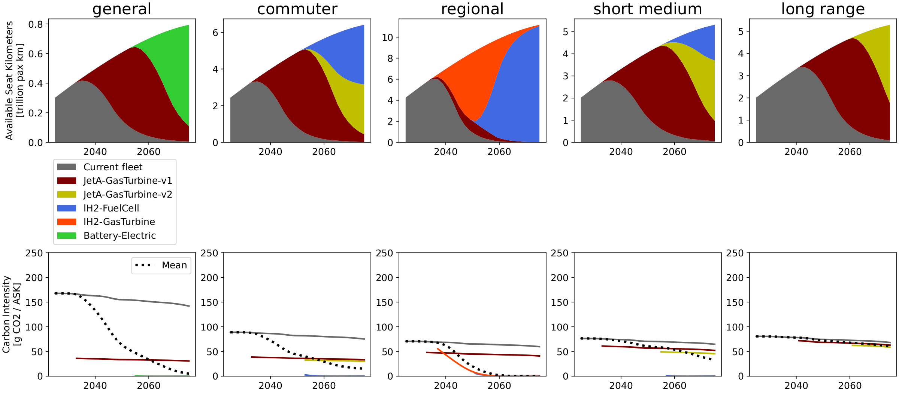
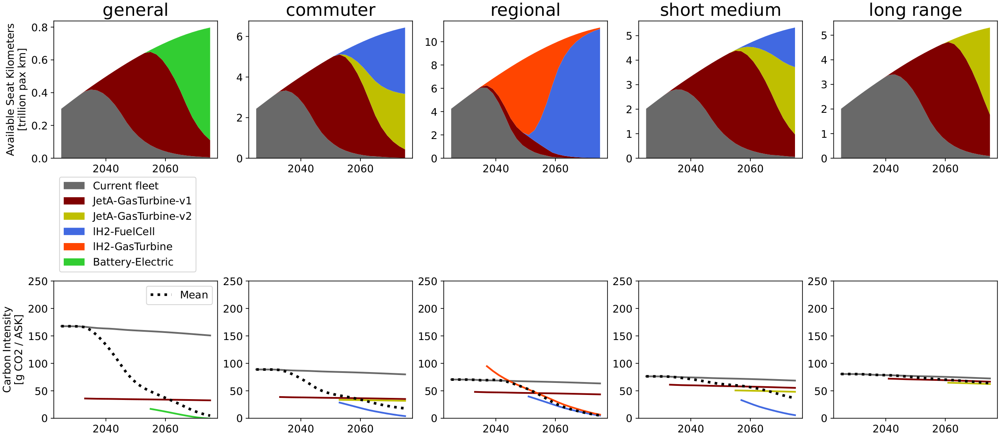
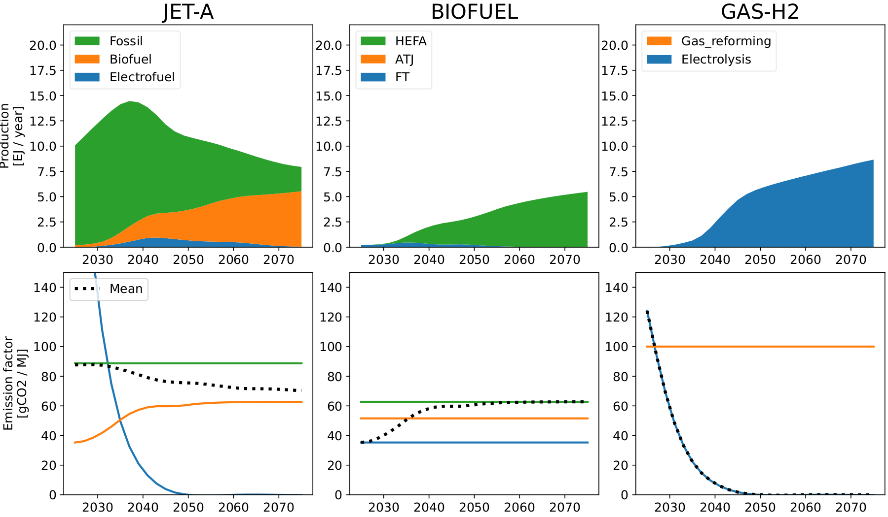
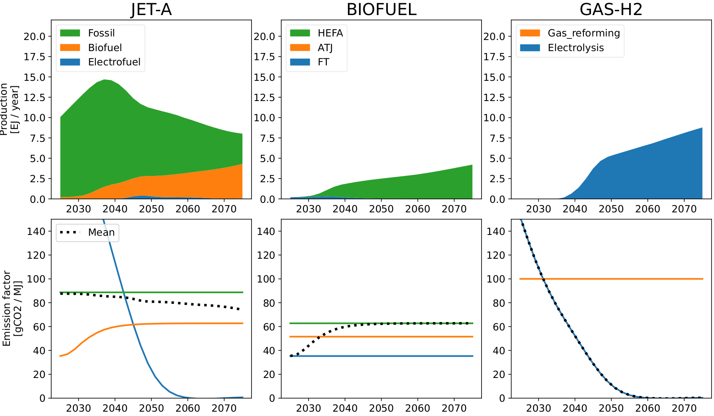
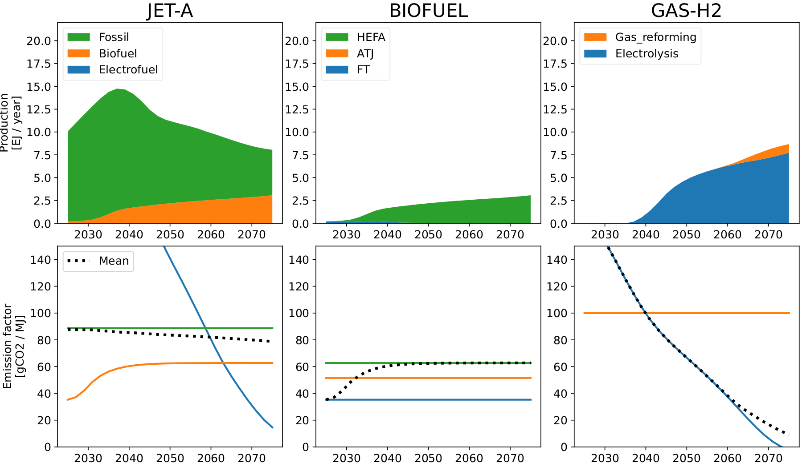
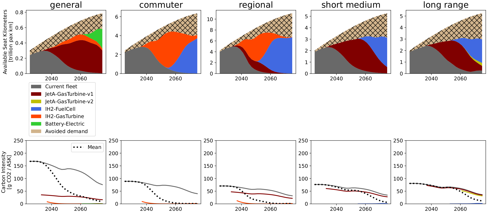
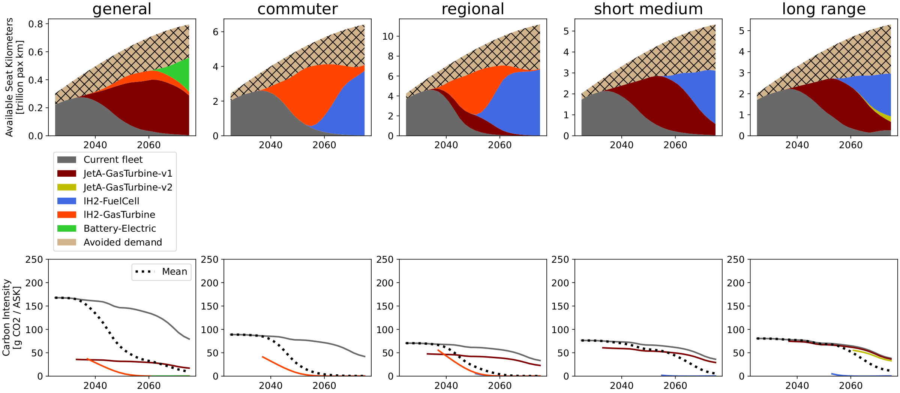
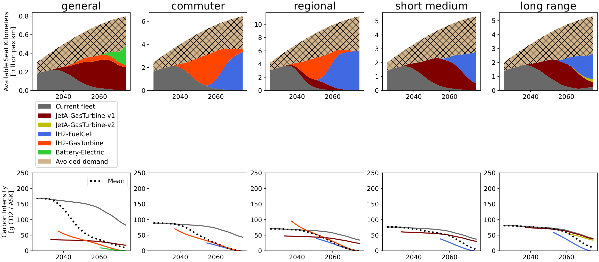
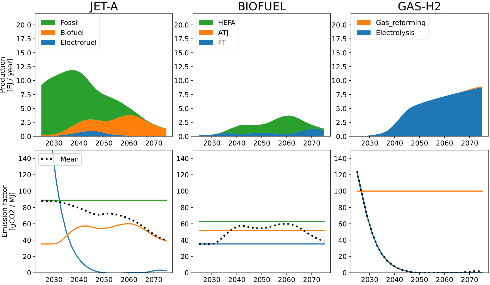
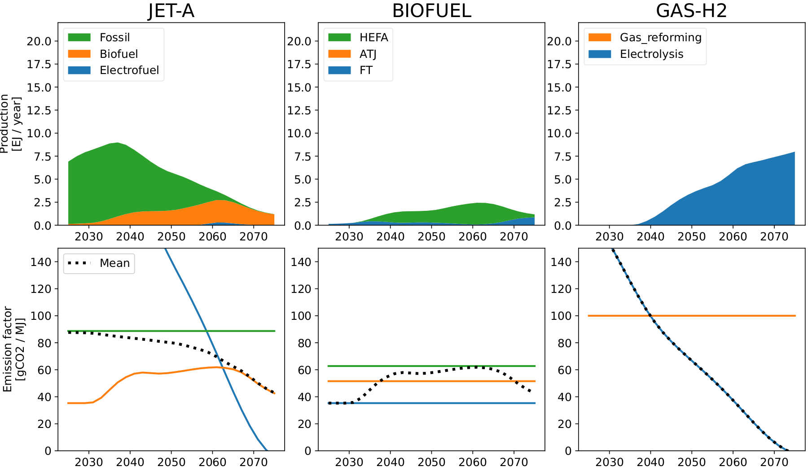

<!--
 Copyright 2025 ISAE-SUPAERO, https://www.isae-supaero.fr/en/
 Copyright 2021 IRT Saint Exupéry, https://www.irt-saintexupery.com

 This work is licensed under the Creative Commons Attribution-ShareAlike 4.0
 International License. To view a copy of this license, visit
 http://creativecommons.org/licenses/by-sa/4.0/ or send a letter to Creative
 Commons, PO Box 1866, Mountain View, CA 94042, USA.
-->

# Scenario-robust mitigation policy

As the SSP2-2.6 was chosen as background scenario for the single policy optimization,
we include scenarios SSP2-1.9 and SSP2-3.4 in the scenario-robust optimization, to
account for different radiative forcing targets, representing a more ambitious and a
less ambitious scenario. The outcomes of this multi-scenario policy optimization are
shown in {numref}`fig-robust-trends`, {numref}`fig-robust-jetfuel`, and
{numref}`fig-robust-carriers`. Compared to the single-scenario optimum, the robust
optimum display higher emissions on the target scenario SSP2-2.6, yet it allows for
greater flexibility in the case an adjacent global scenario takes place. Overall, this
is due to smaller shares of alternative aircraft, driven by the strong difference in
the availability of electricity and emission factor associated to grid electricity
among the scenarios. The overall strategy is to use the worst case scenario (higher
electricity emission factor and less electricity availability) to determine the
deployment of alternative aircraft, and use the surplus electricity in the other
scenarios to make extra electrofuels for conventional aircraft, leaving room for more
variability.

Among these three scenarios, lower warming levels lead to: earlier deployment of
electrofuels due to lower electricity emission factor, higher shares of electrofuel
due to the higher electricity availability, higher shares of FT pathway in the biofuel
blend, and higher shares of biofuel in the Jet-A blend.

```{figure} ../figures/figs/multi_ensemble_trends.png
:name: fig-robust-trends
:width: 90%

Comparison of trend and low-demand scenario-robust mitigation under Mid aircraft
technology and background scenarios SSP2 with RCP's 1.9, 2.6, and 3.4. These
strategies prioritizes flexibility by sizing alternative-aircraft deployment for the
worst electricity conditions (SSP2-3.4), yielding higher SSP2-2.6 emissions but
greater adaptability across SSP2-1.9 and SSP2-3.4.
```

```{figure} ../figures/figs/multi_ensemble_jet_fuel.png
:name: fig-robust-jetfuel
:width: 95%

Jet-A fuel blend for the scenario-robust mitigation policies (legend as in
{numref}`fig-robust-trends`).
```

```{figure} ../figures/figs/multi_ensemble_fleet_carriers.png
:name: fig-robust-carriers
:width: 95%

Supply per final energy carrier for the scenario-robust mitigation policies (legend as
in {numref}`fig-robust-trends`).
```

## Full results

The complete fleet and energy-mix results per background scenario (supplementary
information of the published article):

**Scenario-robust trend**

::::{tab-set}

:::{tab-item} Fleet, SSP2-1.9

:::

:::{tab-item} Fleet, SSP2-2.6

:::

:::{tab-item} Fleet, SSP2-3.4

:::

:::{tab-item} Energy, SSP2-1.9

:::

:::{tab-item} Energy, SSP2-2.6

:::

:::{tab-item} Energy, SSP2-3.4

:::

::::

**Scenario-robust low-demand**

::::{tab-set}

:::{tab-item} Fleet, SSP2-1.9

:::

:::{tab-item} Fleet, SSP2-2.6

:::

:::{tab-item} Fleet, SSP2-3.4

:::

:::{tab-item} Energy, SSP2-1.9

:::

:::{tab-item} Energy, SSP2-2.6

:::

:::{tab-item} Energy, SSP2-3.4

:::

::::

The robust optimizations and comparison figures are produced by these scripts:

```{eval-rst}
.. minigallery:: examples/optimization/robust_policy/*.py
```
