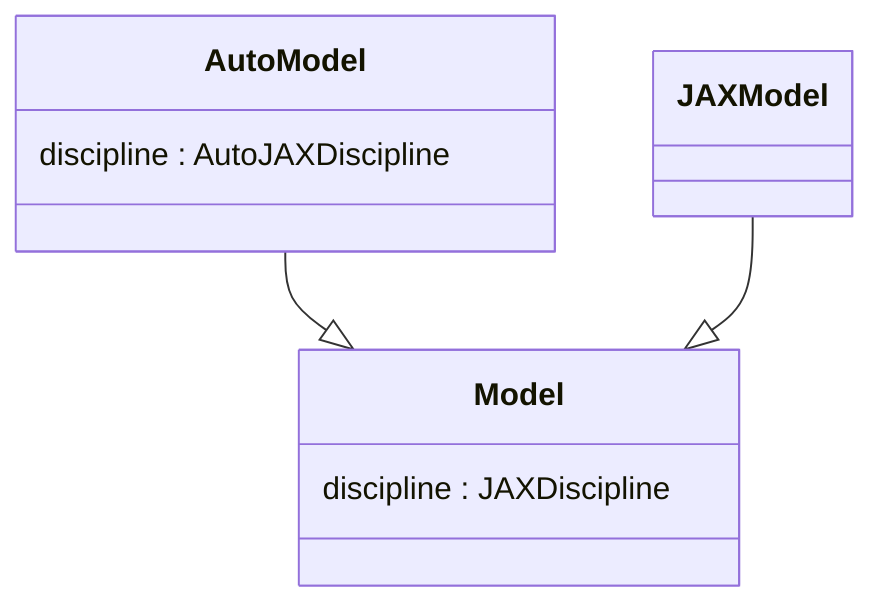
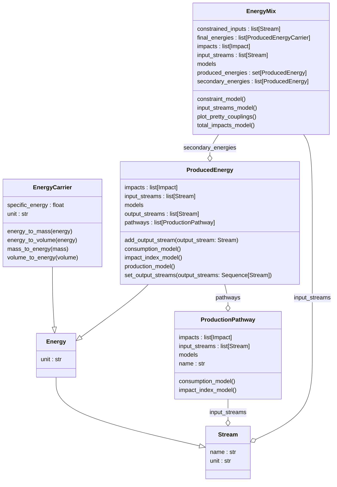

# Object-Oriented Architecture Benefits

The `noads` package demonstrates how object-oriented programming (OOP) principles enable better management of complex multidisciplinary optimization problems.

## Class Hierarchy

The package is built around a class hierarchy that promotes code reuse and modularity:

## Modular Energy System

The energy system is designed with modularity in mind, allowing different production pathways and energy carriers to be composed together:

## Visualization of Couplings

The following diagrams show how different components of the system interact. These visualizations are available as GraphViz `.dot` files in the `docs/examples/optimization/single_policy/` directory.

**Note**: The `.dot` files are GraphViz source files that define the coupling diagrams. To view them:
- Copy the contents and paste into an online GraphViz viewer (e.g., [dreampuf.github.io/GraphvizOnline](https://dreampuf.github.io/GraphvizOnline/))
- Or install GraphViz locally and use: `dot -Tpng file.dot -o output.png`

### General System Overview

The general system overview shows the high-level data flow between major components:

📄 [general.dot](../examples/optimization/single_policy/general.dot) - Download to view with GraphViz

### Fleet Assembly

Fleet assembly shows how different aircraft types are composed into a complete fleet:

📄 [fleet_assembly.dot](../examples/optimization/single_policy/fleet_assembly.dot) - Download to view with GraphViz

### All Couplings

The complete coupling diagram shows all interactions between models:

📄 [all_couplings.dot](../examples/optimization/single_policy/all_couplings.dot) - Download to view with GraphViz

### Energy Mix Couplings

#### Complete Energy Mix

The complete energy mix showing all production pathways and their connections:

📄 [energy_mix_complete.dot](../examples/optimization/single_policy/energy_mix_complete.dot) - Download to view with GraphViz

#### Production and Consumption

Energy production and consumption flows:

📄 [energy_mix_prod_conso.dot](../examples/optimization/single_policy/energy_mix_prod_conso.dot) - Download to view with GraphViz

#### Impact Calculation

How impacts are calculated through the energy system:

📄 [energy_mix_impact.dot](../examples/optimization/single_policy/energy_mix_impact.dot) - Download to view with GraphViz

## Benefits of This Architecture

1. **Modularity**: Components can be developed, tested, and modified independently
2. **Reusability**: Common patterns are abstracted into base classes
3. **Extensibility**: New energy carriers or production pathways can be added without modifying existing code
4. **Maintainability**: Clear separation of concerns makes the codebase easier to understand and maintain
5. **Testability**: Individual components can be unit tested in isolation
