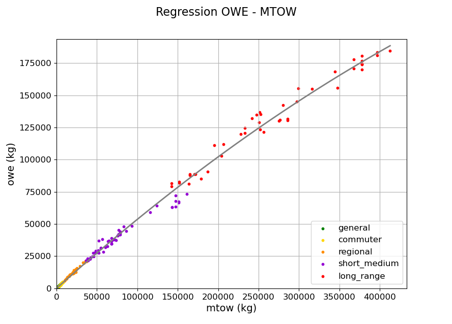

<!--
 Copyright 2025 ISAE-SUPAERO, https://www.isae-supaero.fr/en/
 Copyright 2021 IRT Saint Exupéry, https://www.irt-saintexupery.com

 This work is licensed under the Creative Commons Attribution-ShareAlike 4.0
 International License. To view a copy of this license, visit
 http://creativecommons.org/licenses/by-sa/4.0/ or send a letter to Creative
 Commons, PO Box 1866, Mountain View, CA 94042, USA.
-->

<!--
 Copyright 2025 ISAE-SUPAERO, https://www.isae-supaero.fr/en/
 Copyright 2025 IRT Saint Exupéry, https://www.irt-saintexupery.com

 This work is licensed under the Creative Commons Attribution-ShareAlike 4.0
 International License. To view a copy of this license, visit
 http://creativecommons.org/licenses/by-sa/4.0/ or send a letter to Creative
 Commons, PO Box 1866, Mountain View, CA 94042, USA.
-->

# Generic Airplane Model (GAM) V2.0

Generic Airplane Model (GAM) is a Python toolbox for **preliminary airplane design based on statistical regressions**. GAM covers various airplane propulsion systems, including conventional thermal engines, electric engines, and fuel cells, as well as various energy sources such as kerosene, hydrogen, batteries, methane, and ammonia.

The tool was developed by ENAC and ISAE-SUPAERO in Toulouse, France.

***

## Principle

The airplane design procedure usually involves Multidisciplanary Design Optimization (MDO), with strong interdisciplinary couplings.
The Generic Airplane Models is an extremely simplified procedure which relies on empirical regressions. It can be used to quicly estimate the mass and performances
of a tube-and-wing airplane.

See below an example of correlation between Operational Weight Empty (OWE) and Maximum Take-Off Weight (MTOW).

## Getting started

1) Download the python sources.
2) Run the use-case available in [models/usecase.py](models/usecase.py)

If you want to explore the database, and retrieve the results of this [article](https://doi.org/10.2514/6.2024-1707)

3) download the CADO Airplane Database ([available upon request](#Contact))and put it in the `database/` repository.
4) run [generic_airplane_model.py](models/generic_airplane_model.py) with a Python interpreter (3.8 or higher)

You will find other data plot examples in [utils/data_analysis.py](utils/data_analysis.py).

## Dependencies
This project relies on the following Python packages:
- Numpy
- Scipy
- Copy
- Pandas

## Funding

This research was funded by the Fédération ENAC ISAE-SUPAERO ONERA, Université de Toulouse, France.

## License

> This **second version** of GAM is available under the [GNU Lesser General Public License](LICENSE.txt).
> If you publish your work, please cite the following contribution in your work:
[Kambiri et al., *Energy consumption of Aircraft with new propulsion systems
and storage media*, Scitech Forum, Orlando, January 2024](https://doi.org/10.2514/6.2024-1707)

> The *CADO airplane database* is available at [entrepot.recherche.data.gouv.fr](https://doi.org/10.57745/LLRJO0) under the [Open Database License](database/DATABASE_LICENSE.txt). Any rights in individual contents of the database are licensed under the [Database Contents License](http://opendatacommons.org/licenses/dbcl/1.0/).
>
> In a nutshell, you are free:
> * To share: to copy, distribute and use the database.
> * To create: to produce works from the database.
> * To adapt: to modify, transform and build upon the database.
>
> As long as you:
> * **Attribute**: You must attribute any public use of the database, or works produced from the database, in the manner specified in the ODbL. For any use or redistribution of the database, or works produced from it, you must make clear to others the license of the database and keep intact any notices on the original database.
> * **Share-Alike**: If you publicly use any adapted version of this database, or works produced from an adapted database, you must also offer that adapted database under the ODbL.
> * **Keep open**: If you redistribute the database, or an adapted version of it, then you may use technological measures that restrict the work (such as DRM) as long as you also redistribute a version without such measures.
>
> This database was developed in the french national school of civil aviation (ENAC, Toulouse, FRANCE) by the Conceptual Airplane Design and Operations team (CADO).

## Contact

For any request please contact [yri-amandine.kambiri(at)enac.fr]()
